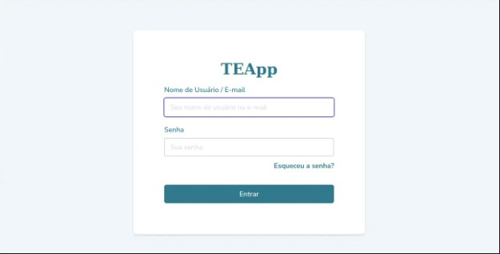
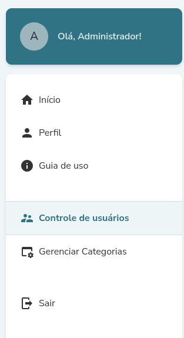

# **IBEAC-Web**

Plataforma Social Moderada para Disseminação de Informações sobre Saúde 

## **Objetivo do projeto de extensão CodeLab-Unifesp - IBEAC**

[![NPM Version][npm-image]][npm-url]
[![Build Status][travis-image]][travis-url]
[![Downloads Stats][npm-downloads]][npm-url]

O projeto CodeLab-Unifesp desenvolve uma plataforma de comunicação e interação social para que a organização social IBEAC - Instituto Brasileiro de Estudos e Apoio Comunitário Queiróz Filho - dissemine informações de saúde a gestantes e puérperas das comunidades da zona sul da cidade de São Paulo, como Parelheiros. A ideia, formatada a partir de várias reuniões com representantes da ONG, é desenvolver um aplicativo de fórum de discussão que criará uma ponte entre especialistas em primeira infância do CEPI (Centro de Estudos em Primeira Infância) e as mães e puérperas. 

O aplicativo tem o objetivo de contribuir para a melhoria da qualidade de vida de gestantes e mães com bebês pequenos. Essa ferramenta digital de apoio permitirá o compartilhamento de informações seguras sobre saúde materna, cuidado com bebês direito das mulheres, além de trocas solidárias, indicação de cultura e lazer, entre outros temas relevantes para esse público. 

O projeto tem potencial de atingir um grande número de pessoas da comunidade, visto que a ONG trabalha com toda a região de Parelheiros e tem atuação e reconhecimento nacionais. O software a ser desenvolvido será de licença livre e poderá ser usado também por outras comunidades.

## **Público-Alvo (quem são os usuários e onde o projeto será usado)**

O aplicativo será utilizado por gestantes e mães com bebês pequenos de comunidades fragilizadas da zona sul de São Paulo, tal como profissionais da saúde capacitados para fornecer orientação para o público que será beneficiado.

## **Tecnologias Utilizadas**
React, Docker, Flask, pgAdminSQL

## **Como Rodar o Projeto**

O [Link](https://drive.google.com/drive/folders/1z0qnA4ehYOzNW1zUNNMTGxRZliSizoqD) tem algumas reuniões antigas do projeto, assistam o segundo vídeo e façam as seguintes alterações também:

### pull official base image
FROM node:18-alpine
ENV NODE_ENV=development

### set working directory
WORKDIR /app

### add `/app/node_modules/.bin` to $PATH

ENV PATH=/app/node_modules/.bin:$PATH

### install app dependencies
COPY package.json .

COPY yarn.lock .

RUN yarn install

RUN yarn global add eslint

RUN yarn global add react-scripts@4.0.3

### add app
COPY . .

EXPOSE 3000

### start app
ENV NODE_OPTIONS=--openssl-legacy-provider
CMD ["yarn", "start"]

## **Protótipo**
[Link do Figma](https://www.figma.com/design/Z0QdeIBaIOQEqHDpdP8Dqe/Admin-dash?node-id=6-163&t=9WkzdBZDKI3XitWL-1)

## **Imagens do Protótipo**

### **Página de Login**


### **Menu**


## **Ambientes**

### **Desenvolvimento**

**WEB**
https://plasmedis-web-dev.herokuapp.com/

**API**
http://plasmedis-api-dev.herokuapp.com/

## **Configuração para Desenvolvimento**

### **Preparando Ambiente:**
* Instalar Nodejs: https://nodejs.org/en/download/
* Instalar Yarn: `npm install --global yarn` (no terminal)
* Instalar o git: https://git-scm.com/downloads

### **Baixando o repositorio: (todos os comandos são executados no terminal)**
* `git clone https://github.com/CodelabUnifesp/ibeac-web` (o código sera baixado na pasta ibeac-web)
* Entrando no diretório do código: `cd ibeac-web`
* Instalando dependências: `yarn install`

### **Rodando a aplicação Localmente:**
* No terminal, no diretório raiz do código, rode o comando: `yarn start`

### **Criando uma nova branch de desenvolvimento:**
* No terminal, no diretório raiz do código, rode o comando: `git checkout -b issue-XXXX` (XXXX = numero da issue)
* Depois adicione essa branch ao repositório: `git push --set-upstream origin issue-XXXX` 

### **Aplicando alterações: (todos os comandos são executados no terminal)**
* Adiciona todas as modificações feitas: `git add .`
* Comentar as mudanças implementadas: `git commit -m "meus comentarios resumindo as mudanças"`
* Envia as mudanças ao repositório: `git push`

### **Abrindo o pull request:**
* No repositorio do git, vá em pull requests > new pull request, defina o base como "master" e compare como a branch "issue-XXXX" (sua branch atual)
clique em Create Pull Request

## **Organização do Código**

Encontram-se nessa seção, sugestões de diretrizes para organização do código.

### **Gerenciador de Pacotes do Node.js**

Ao adicionar, remover ou manipular pacotes para o projeto, utilizar o gerenciador de pacotes **yarn**.
(Ao invés de *npm install*, utilizar o *yarn install*)

### **Responsividade**

Ao implementar as páginas, ter cuidado com a responsividade dos componentes e do comportamento geral em telas de diferentes resoluções.

### **Convenções de nome para variáveis, constantes e funções**

Dar preferência ao inglês, mas mantendo em português palavras com relação direta às regras de negócio:

- Postagem
- Comentário
- Bairro
- Categoria

### **Estrutura de pastas/responsabilidade de código**

Manter todas as funções que realizam chamadas à api devem ficar centralizadas dentro da pasta "/domain".

### **Consistência e Qualidade de Código**

As regras para consistência e qualidade de código do projeto são aplicadas pelo eslint/prettier. Essas regras são baseadas no style guide da Airbnb, com alterações presentes no arquivo de configuração ".eslintrc.js".

Pelo **Visual Studio Code**, o código pode ser automaticamente formatado ao salvar qualquer documento. Para isso é necessário instalar as extensões: **ESLint** e **Prettier - Code formatter**

### **Convenções de Nome para Branches/Commits**

*tbd*

### **Estilos, Temas e Cores**

*tbd*

## **Diagramas**

### **Banco de Dados**


### **Funcionalidades**


Cadastro de Novos Usuários


Cadastro de Novo Bairro


Complemento de Dados


Criar Postagem


Comentar Postagem


Complemento de Dados


Formulário Socioeconômico


Verificar Postagem

### **Hipotéticos**

Diagramas-sugestão para algumas funcionalidades, não necessáriamente reflete como a funcionalidade vai/foi implementada.


Esqueci minha Senha

## **Rodando com Docker**
* Para construir o container ```docker-compose build```

* Para iniciar o serviço ```docker-compose up```

* [Opcional] Para rodar algum comando dentro do container ```docker-compose exec ibeac-front bash```

## **Status**

- [ ] Em ideação
- [x] Em desenvolvimento
- [ ] Testando com usuário
- [ ] Em uso
- [ ] Descontinuado